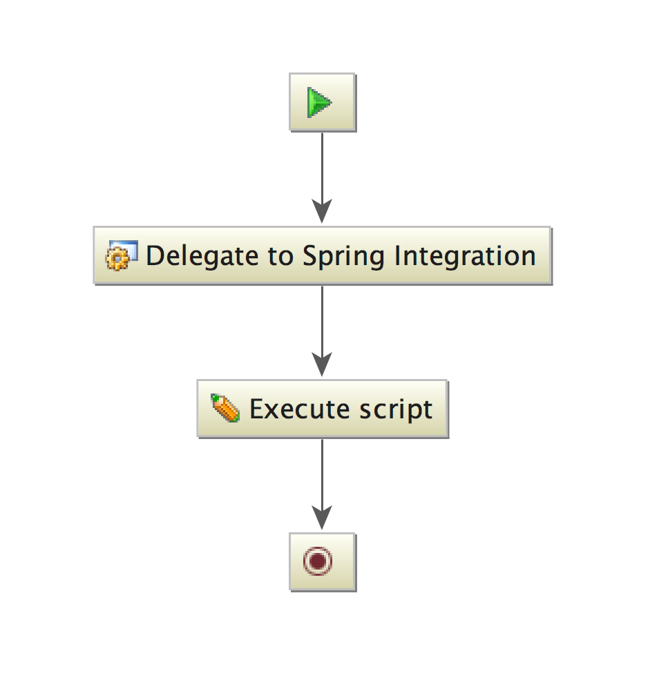
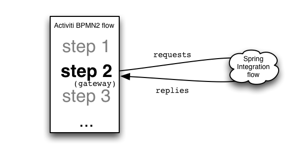

# Orchestration and Integration

(Yes, I'm aware the title reads like something straight out of 1999!)

I received an email recently that asked about how to forward control from a wait-state in an Activiti (which is an open-source BPMN2 workflow engine from Alfresco) to a Spring Integration flow and then  resume execution of the Activiti workflow process upon completion of some work in Spring Integration.

To really appreciate why this is useful goal, we need some background.


## What is Activiti
Activiti is a _business process engine_. It's basically a directed graph. It keeps track of the progression of work described in a business process. It makes it easy to describe automatic- and human-based actors in a system. It also supports interrogating the business process engine to ask questions about the process instances underway: how many of them are there, which ones are stalled, etc. Business Process Management Systems (BPMS) offer many advantages, some of which are:

- collaborative processes where humans and services are used to drive towards a larger business requirement (imagine loan approval, legal compliance, document revision, etc)
- supporting auditability and history of processes in an organization.
- ease-of-modeling complex business processes

This last point merits some focus: a good BPM engine like Activiti supports visually modeling business processes. UML supports visually describing processes using activities (steps) and swimlanes (agents involved in satisfying those steps). UML, of course, is just a modeling tool. It has no runtime semantics. The holy grail of business process management has been to have a modeling notation that could be used by business analysts _and_ application developers. [BPMN 2](https://en.wikipedia.org/wiki/Business_Process_Model_and_Notation) is as as close as we've come towards achieving that goal.

Here, for example, is a visual model of a _very_ simple business process.



And here is the standardized XML that's been created to support that model. This XML has execution semantics, _not_ just modeling semantics.

```xml
<?xml version="1.0" encoding="UTF-8"?>
<definitions id="definitions"
             xmlns="http://www.omg.org/spec/BPMN/20100524/MODEL"
             xmlns:activiti="http://activiti.org/bpmn"
             typeLanguage="http://www.w3.org/2001/XMLSchema"
             expressionLanguage="http://www.w3.org/1999/XPath"
             targetNamespace="http://www.activiti.org/bpmn2.0">

    <process id="asyncProcess">

        <startEvent id="start"/>

          <sequenceFlow
            id="flow1"
            sourceRef="start"
            targetRef="sigw"/>

        <serviceTask id="sigw"
           name="Delegate to Spring Integration"
           activiti:delegateExpression="#{gateway}"/>

           <sequenceFlow
            id="scriptFlow"
            sourceRef="sigw"
            targetRef="confirmMovementTask"/>

        <scriptTask id="confirmMovementTask"
            name="Execute script" scriptFormat="groovy">
            <script>
                println 'Moving on..'
            </script>
        </scriptTask>

          <sequenceFlow
            id="flow2"
            sourceRef="confirmMovementTask"
            targetRef="theEnd"/>

        <endEvent id="theEnd"/>

    </process>

</definitions>
```

Most analysts won't write this XML by hand. Instead, they'll use a modeling tool like [Alfresco's Activiti Cloud](https://www.alfresco.com/products/business-process-management). The XML artifact, however, is round-trippable: it may be annotated by developers and then revised in the modeling tool.

On inspection, though, you'll see that most of this isn't very complicated. The process has several states:

 - **`startEvent`** - where the process starts
 - **`serviceTask`** - invoke the Spring bean called `gateway` (more on this later!)
 - **`scriptTask`** - print out a simple message
 - **`endEvent`** - done

The ordering is explicitly spelled out by the various `sequenceFlow` elements which connect nodes.

Activiti is a great way to keep track of business process state, but it's not a particularly powerful component model or integration technology. Also, it doesn't really integrate well with the outside world. For that we need an integration framework like Spring Integration..


## What is Spring Integration

Spring Integration supports the integration of services and data across multiple otherwise incompatible systems. Conceptually, composing an integration flow is similar to composing a pipes-and-filters flow on a UNIX OS with `stdin` and `stdout`:

```
cat input.txt |  grep ERROR | wc -l > output.txt
```

In the example, we take data from a source (the file `input.txt`), pipe it to the `grep` command to filter the results and keep only the lines that contain the token `ERROR`, and then pipe it to the `wc` utility which we to count how many lines there are. Finally, the final count is written to an output file, `output.txt`. These components -  `cat`, `grep`, and `wc` -  know nothing of each other. They were not designed with each other in mind. Instead, they know only how to read from `stdin` and  write  to `stdout`. This normalization of data makes it very easy to compose complex solutions from simple atoms. In the example, the act of `cat`ing a file turns data that is not on `stdin` into data that is on `stdin`. It _adapts_ the inbound data into the normalized format, lines of strings. At the end, the redirect (`>`) operator turns the normalized data, lines of strings, into data on the file system. It _adapts_ it. The pipe (`|`) character is used to signal that the output of one component should flow to the input of another.

A Spring Integration flow works the same way: data is normalized into `Message<T>` instances. Each `Message<T>` has a payload and headers - metadata about the payload in a `Map<K,V>` -  that are the input and output of different messaging components. These messaging components are typically provided by Spring Integration, but it's easy to write and use your own. There are all manner of messaging components supporting all the [the common Enterprise Application Integration  patterns](http://www.enterpriseintegrationpatterns.com/) (filters, routers, transformers, adapters, gateways, etc.). The Spring framework `MessageChannel` is a named conduit through which `Message<T>`s flow between messaging components. They're pipes and, by default, they work sort of like a `java.util.Queue`.

Spring Integration inbound adapters _adapt_ data from external systems (message queues like RabbitMQ, Apache Kafka, and JMS, email, Twitter, file system changes, IoT-devices, and a zillion other systems) into `Message<T>`s. Spring Integration outbound adapters do the same, in reverse, taking `Message<T>`s and writing them to an external system.

Spring Integration supports _event-driven architectures_ because it can help detect and then respond to events in the external world. For example, you can use Spring Integration to poll a filesystem every 10 seconds and publish a `Message<T>` whenever a new file appears. You can use Spring Integration to act as a listener to messages delivered to a Apache Kafak topic. The adapter handles responding to the external, unpredictable, event.

Inbound gateways take incoming requests from external systems, process them as `Message<T>`s, and send a reply. Outbound gateways take `Message<T>`s, forward them to an external system, and await the response from that system. They support request and reply interactions.


## An Activiti and Spring Integration Gateway

Activiti can be used to describe a complex, long-running process in terms of recorded, auditable, and predictable states, and Spring Integration can be used to, well, _integrate_! Spring Integration is where we keep the interesting Java code, and Activiti keeps track of the auditable state. It's convenient, then, [that Spring Boot, Spring Integration and Activiti work so well together](https://spring.io/blog/2015/03/08/getting-started-with-activiti-and-spring-boot)!

One common use case is to initiate a BPM process with Activiti and then, on entering a wait-state, delegate handling of that state to Spring Integration which can, of course, spread the work to other systems. Here's a simple diagram illustrating the flow.



BPM process states can often involve human agents. For example, a workflow engine may have a state where a document is sent to a human for approval, but the reviewer is on vacation and won't be back for weeks. It would be wasteful, not to mention dangerous, to keep a thread open with the expectation that whatever confirmation is needed to continue processing will come back within milliseconds or seconds.

Activiti is smart enough to pause execution, persist execution state to a database during a wait-state, and only resume upon having the process execution _signaled_. Signalling the process engine rehydrates the process and resumes execution. A simple example might be a new user enrollment business process that delegates to Spring Integration to send an email with a sign up confirmation link. It may take days for the user to click the confirmation link, but on clicking, the system should proceed with the enrollment business process.

In this post we're going to look at how to initiate a BPM process that enters a wait-state and then delegates to Spring Integration to do some kind of custom processing and then, in the far flung future, resumes execution of the process.

We'll setup two Spring Integration flows: one to handle requests from Activiti into Spring Integration and another that handles eventual replies and triggers the resumption of the process.

We'll need something to kick off our process, so here's a simple REST endpoint (`http://localhost:8080/start`) that launches a new process each time:

```java
@RestController
class ProcessStartingRestController {

	@Autowired
	private ProcessEngine processEngine;

	@RequestMapping(method = RequestMethod.GET, value = "/start")
	Map<String, String> launch() {
		ProcessInstance asyncProcess = this.processEngine.getRuntimeService()
				.startProcessInstanceByKey("asyncProcess");
		return Collections.singletonMap("executionId", asyncProcess.getId());
	}
}
```

Messages will flow across two `MesssageChannel`s that we'll create in a `@Configuration` class: `requests` and `replies`.

```java
@Configuration
class MessageChannels {

	@Bean
	DirectChannel requests() {
		return new DirectChannel();
	}

	@Bean
	DirectChannel replies() {
		return new DirectChannel();
	}
}
```

The nice thing about using a `@Configuration` class is that it is itself a Spring component and can be injected anywhere. We can dereference the channels by invoking the `@Bean` provider methods directly. The alternative is to use `@Qualifier` everytime we inject a reference to one of the channels, e.g.:

```java

public static final String REPLIES_CHANNEL_NAME = "replies";

@Autowired
@Qualifier(REPLIES_CHANNEL_NAME)
private MessageChannel replies;
```

Our BPMN is pretty straightforward, but we'll use an Activiti-specific namespace attribute, `activiti:delegateExpression="#{gateway}"`, to tell Activiti to call a bean named `gateway` that's registered in Spring. Activiti knows to do this because this application uses the Activiti auto-configuration for Spring Boot which, among many other things, exposes Spring-managed beans to the Activiti expression-language. The `gateway` is an Activiti-based bean of type `ReceiveTaskActivityBehavior`. Spring Boot has auto-configurations for both Spring Integration and Activiti so 90% of the tedious setup goes out the window.

Let's look at our simple `gateway` component, an implementation of Activiti's `ActivityBehavior` interface that acts as a callback where we can send a `Message<T>` into the `requests` channel and kick off our Spring Integration flow. The important thing here is that we've captured the `executionId` which we'll need later to _resume_ or _signal_ the process.

```java
@Bean
ActivityBehavior gateway(MessageChannels channels) {
  return new ReceiveTaskActivityBehavior() {

    @Override
    public void execute(ActivityExecution execution) throws Exception {

      Message<?> executionMessage = MessageBuilder
          .withPayload(execution)
          .setHeader("executionId", execution.getId())
          .build();

      channels.requests().send(executionMessage);
    }
  };
}
```

The `Message<T>` will pop out the other side of the `requests` `MessageChannel` and something needs to process it. In a sophisticated example, it'd be trivial to transform the request into a meaningful message and then, for example, forward it to some other system like e-mail. Here, we just print out the headers so that we can note the `executionId` and use that later.

```java
@Bean
IntegrationFlow requestsFlow(MessageChannels channels) {
	return IntegrationFlows.from(channels.requests())
			.handle(msg -> msg.getHeaders().entrySet()
					.forEach(e -> log.info(e.getKey() + '=' + e.getValue())))
			.get();
}
```

At this point, the workflow definition will have been persisted and there is no active process instance. We need to signal it, somehow, asynchronously. We'll do so using a REST endpoint, `http://localhost:8080/resume/{executionId}`. REST is easy to grok, but really we could've used any event from any external system that Spring Integration knows about to achieve this effect. The only thing to ensure is that, whatever the external event, we're somehow able to send the `executionId` along, as we do here by capturing it in the URI.

```java

@RestController
class ProcessResumingRestController {

	@Autowired
	private MessageChannels messageChannels;

	@RequestMapping(method = RequestMethod.GET, value = "/resume/{executionId}")
	void resume(@PathVariable String executionId) {

		Message<String> build = MessageBuilder.withPayload(executionId)
				.setHeader("executionId", executionId)
				.build();

		this.messageChannels.replies().send(build);
	}
}

```

When the `Message<T>` flows through the `replies` `MessageChannel`, it'll pop out the other end and, again, something needs to process it. Here, we'll use another Spring Integration flow that takes the incoming `Message<T>` and signals the resumption of the process. Once this flow is executed, you'll see the next step in the process, the `scriptTask`, evaluated and the words "Moving on!" printed to the console.

```java
@Bean
IntegrationFlow repliesFlow(MessageChannels channels,
							ProcessEngine engine) {
	return IntegrationFlows.from(channels.replies())
			.handle(msg -> engine.getRuntimeService().signal(
					String.class.cast(msg.getHeaders().get("executionId"))))
			.get();
}
```

## Next Steps

We've covered a lot! We're involving _both_ a BPM engine and an integration framework to handle processing, and I appreciate that the correct use of the intersection of the two is kind of a niche topic. The goal in this post was to effectively use both, where applicable, to the fullest.  BPM adds a fair amount of [_cognitive load_](https://en.wikipedia.org/wiki/Cognitive_load) for simple integrations but offers a _lot_ of value when business process descriptions must be model- and business analyst-friendly. One common misconception is that developers have to give up the ability to enhance the system once BPM is involved; NOT SO! Thanks to Spring Boot and some hard work from the Activiti team, Activiti works perfectly with all of Spring.

The real power is using BPM to orchestrate complex processing logic: imagine hitting a state in a BPM process and then invoking a Spring Batch job, or calling a REST service with a Ribbon load-balanced `RestTemplate` in Spring Cloud, or forwarding the `Message<T>` into a Spring Cloud Data Flow stream process. Spring Cloud Data Flow is one of my favorite approaches to data processing because it builds on Spring Cloud Stream which in turn builds on Spring Integration: it's `MessageChannel`s all the way down!

The code for [the example is online](https://github.com/joshlong/activiti-examples/tree/master/async-activiti-integration). 
